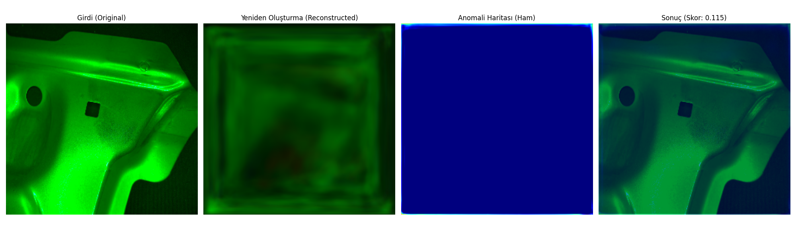

# DRAEM - Anomaly Detection for Industrial Inspection

<p align="center">
  
</p>

## 📋 About

This project is an anomaly detection system based on **DRAEM (Discriminatively trained Reconstruction Anomaly Embedding Model)**. It is designed for defect and anomaly detection in industrial images (e.g., coil manufacturing).

DRAEM is an **unsupervised anomaly detection** model that trains only on **normal (defect-free)** images and can detect abnormal regions during testing.

## 🏗️ Architecture

The model consists of two main sub-networks:

### 1. Reconstructive SubNetwork
- **Encoder-Decoder** architecture
- Reconstructs the input image
- Learns normal images and reconstructs anomalies "incorrectly"

### 2. Discriminative SubNetwork
- **U-Net** like encoder-decoder structure
- Compares original and reconstructed images
- Produces pixel-level anomaly segmentation

## 📁 Project Structure

```
DRAEM_coiltech/
├── train.py                    # Training script
├── detect.py                   # Single image testing and visualization
├── model/
│   └── model_unet.py           # Model architectures (Reconstructive & Discriminative)
├── utils/
│   ├── data_loader.py          # Data loading and augmentation
│   ├── loss.py                 # Focal Loss and SSIM Loss
│   ├── perlin.py               # Perlin noise generation (synthetic anomaly)
│   └── training_logger.py      # Training logging module
├── checkpoints/                # Trained model weights
└── LICENSE                     # MIT License
```

## 🔧 Requirements

```
torch>=1.7.0
torchvision
numpy
opencv-python
matplotlib
imgaug
tqdm
```

### Installation

```bash
pip install torch torchvision numpy opencv-python matplotlib imgaug tqdm
```

## 🎯 Training

### Data Preparation

1. **Normal Images**: Only defect-free images are required for training
2. **Anomaly Source**: Texture images for synthetic anomaly generation (e.g., [DTD Dataset](https://www.robots.ox.ac.uk/~vgg/data/dtd/))

### Directory Structure

```
data/
├── train/
│   └── good/           # Normal images (*.png)
├── test/
│   ├── good/           # Normal test images
│   └── defect_type/    # Anomalous test images
└── ground_truth/       # Anomaly masks (optional)

anomaly_source/         # DTD or similar texture datasets
└── images/
    ├── banded/
    ├── blotchy/
    └── ...
```

### Training Command

```bash
python train.py --gpu_id 0 --obj_id 0 \
  --lr 0.0001 --size 256 \
  --bs 16 --epochs 30 \
  --checkpoint_path "./checkpoints" \
  --data_path "path/to/train/good" \
  --anomaly_source_path "path/to/dtd/images" \
  --log_path "./logs"
```

### Parameters

| Parameter | Description | Default |
|-----------|-------------|---------|
| `--gpu_id` | GPU ID to use | 0 |
| `--obj_id` | Object class ID (-1 for all) | Required |
| `--lr` | Learning rate | Required |
| `--size` | Image size (square) | Required |
| `--bs` | Batch size | Required |
| `--epochs` | Number of epochs | Required |
| `--checkpoint_path` | Model save directory | Required |
| `--data_path` | Training data directory | Required |
| `--anomaly_source_path` | Texture images directory | Required |
| `--log_path` | Log files directory | Required |

## 🔍 Testing / Inference

### Single Image Test

```bash
python detect.py \
  --image_path "path/to/test/image.png" \
  --base_model_name "DRAEM_test_0.0001_30_bs16_18.07_20-23defrom_" \
  --checkpoint_path "./checkpoints" \
  --output_path "result.png" \
  --gpu_id 0
```

### Test Parameters

| Parameter | Description | Default |
|-----------|-------------|---------|
| `--image_path` | Path to test image | Required |
| `--base_model_name` | Model name (without extension) | Required |
| `--checkpoint_path` | Model directory | Required |
| `--output_path` | Output image filename | `single_test_result.png` |
| `--gpu_id` | GPU ID | 0 |

### Output

The test produces a 4-panel visualization:
1. **Input (Original)**: Original test image
2. **Reconstructed**: Image generated by the model
3. **Anomaly Map (Raw)**: Raw segmentation output
4. **Result (Overlay)**: Image merged with heatmap and anomaly score

## 📊 Loss Functions

Three different loss functions are used during training:

1. **L2 Loss (MSE)**: Pixel-level reconstruction loss
2. **SSIM Loss**: Structural similarity loss
3. **Focal Loss**: Solves class imbalance problem for segmentation

```
Total Loss = L2 Loss + SSIM Loss + Focal Loss
```

## 🎨 Synthetic Anomaly Generation

An important feature of DRAEM is generating synthetic anomalies during training:

1. **Perlin Noise**: Creates random anomaly masks
2. **Texture Source**: Texture images are taken from DTD dataset
3. **Augmentation**: Various transformations are applied to texture images
4. **Blending**: Anomaly is added onto the normal image

With this approach, the model can learn anomaly detection without ever seeing real anomalies.

## 📈 Model Performance

Model outputs:
- **Anomaly Score**: Image-level score between 0-1
- **Anomaly Map**: 256x256 pixel-level segmentation
- **Inference Time**: ~10-50ms on GPU (hardware dependent)

## 🔗 References

- [DRAEM Paper](https://arxiv.org/abs/2108.07610): "DRAEM - A discriminatively trained reconstruction embedding for surface anomaly detection"
- [MVTec AD Dataset](https://www.mvtec.com/company/research/datasets/mvtec-ad)
- [DTD Dataset](https://www.robots.ox.ac.uk/~vgg/data/dtd/)

## 📄 License

This project is licensed under the [MIT License](LICENSE).

## 👨‍💻 Developer Notes

### Model Naming Format

Saved model files are named in the following format:
```
DRAEM_test_{lr}_{epochs}_bs{batch_size}_{obj_name}_.pt      # Reconstructive model
DRAEM_test_{lr}_{epochs}_bs{batch_size}_{obj_name}__seg.pt  # Discriminative model
```

### GPU/CPU Support

The model automatically checks GPU availability. If no GPU is available, it runs on CPU:

```python
if torch.cuda.is_available():
    device = torch.device(f"cuda:{gpu_id}")
else:
    device = torch.device("cpu")
```

---

<p align="center">
  <b>DRAEM - Coiltech Anomaly Detection System</b><br>
  A powerful solution for industrial image processing and anomaly detection
</p>
